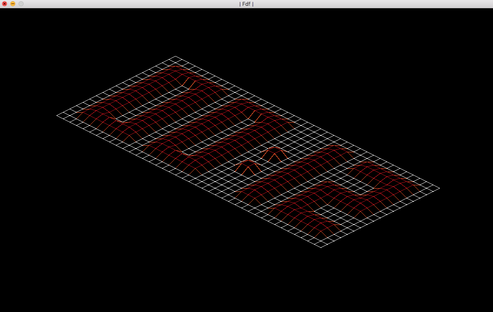

#fdf
  
Projet Ecole 42 (Paris)
..
##Synopsis
  
fdf ('fil de fer') is a graphic project which create an isometric map viewer in 2D. The program uses a map given in argument and convert its coordinates into an isometric projection using OpenGl and the minilibx library (school graphic lib).
  
####Evenements disponibles :
* + : zoom positif
* - : zoom negatif
* 1/2 : changer de perspective
* page up : augmenter l'élévation
* page down : baisser l'élévation
* escape : quitter le programme
  

